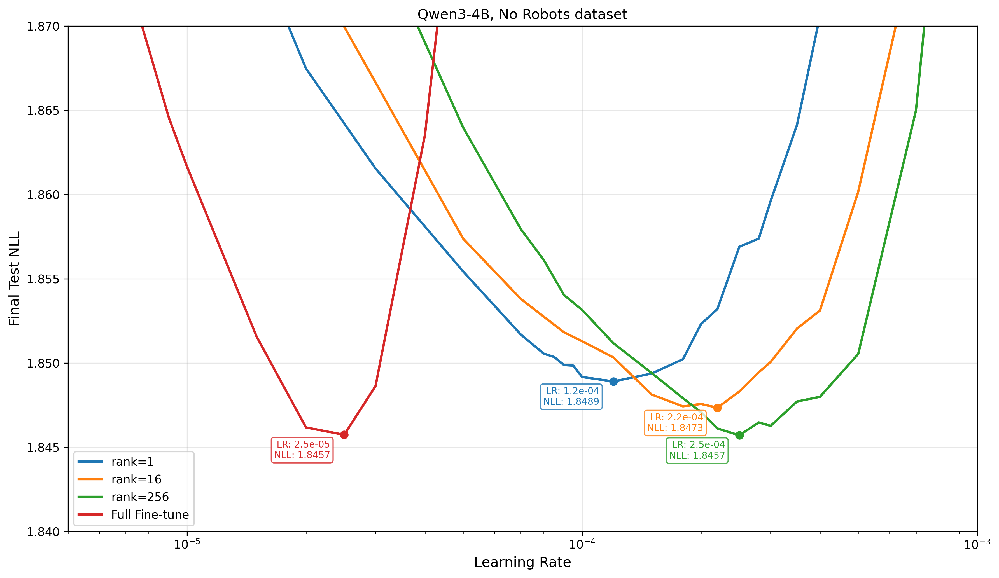
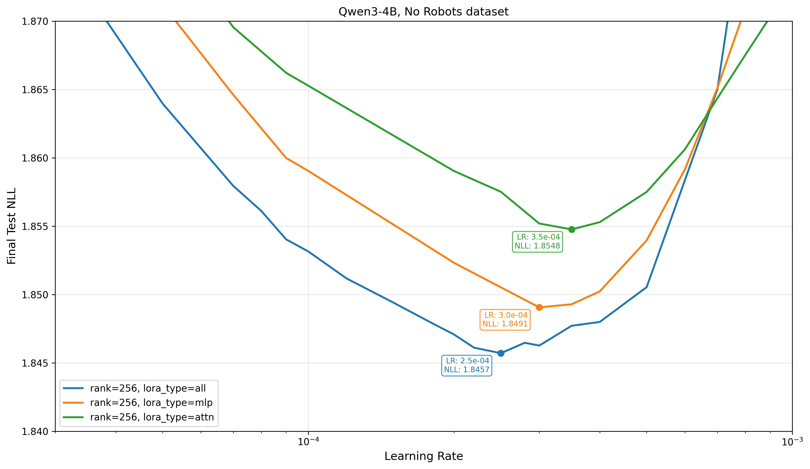
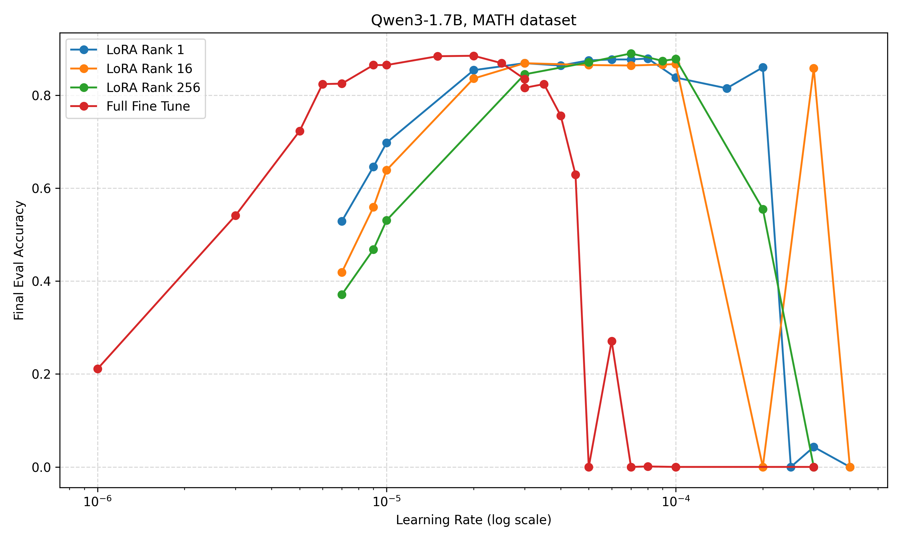

# Reproducing LoRA without Regret

## tl;dr
This repository contains the code and results for reproducing the SFT and RL experiments in the [LoRA without Regret blog post](https://thinkingmachines.ai/blog/lora/) by John Schulman and Thinking Machines.

We reproduce the same finding that **LoRAs can match full fine tuning performance in low data regimes**, and observe similar patterns in optimal learning rates for various LoRA configurations.

Key results:
1. In a low data regime, LoRA SFT and RL can match performance of full fine-tuning.
2. Optimal learning rate of LoRA is around 10x higher than full fine tuning.
3. For SFT, lower rank LoRAs have lower optimal learning rates

## SFT Experiments
Model: [Qwen3-4B](https://huggingface.co/Qwen/Qwen3-4B)

Dataset: We use the first 6400 examples in the train split of the [No Robots dataset](https://huggingface.co/datasets/HuggingFaceH4/no_robots) and the first 100 examples in test split for validation. No Robots is an instruction following dataset collected by human annotators.

We do learning rate sweeps for the following configurations:
- Full fine tune
- Rank 256 LoRA applied to attn-only
- Rank 256 LoRA applied to mlp-only
- Rank 256 LoRA applied to mlp and attn
- Rank 16 LoRA applied to mlp and attn
- Rank 1 LoRA applied to mlp and attn

We hold the following hyperparameters constant for every run:
- Train for one epoch with effective batch size of 32, so we train for a total of 200 steps.
- AdamW optimizer
- LoRA alpha = 32
- Constant learning rate scheduler

### Results
| Rank | Type | Optimal LR  | Test NLL |
|------|------|-------------|--------------|
| 1    | All | 1.2e-4      | 1.8489 |
| 16   | All | 2.2e-4      | 1.8473 |
| 256  | All | 2.5e-4      | 1.8457 |
| 256  | Attn-only | 3.5e-4      | 1.8548 |
| 256  | MLP-only | 3.0e-4      | 1.8491 |
| Full Fine-Tune |  | 2.5e-5 | 1.8457 |

We can see from the chart that LoRA SFT matches test NLL of full fine-tuning. We also observe that the rank 256 LoRA has a 10x higher optimal learning rate than the full fine tune. We also observe that the optimal learning rate for lower rank LoRA's are lower than higher rank LoRA's, from 2.5e-4 for rank 256 to 1.2e-4 for rank 1.

### Limitations

We also observe that applying LoRA to the MLP and attention layers perform better than MLP-only as opposed to the finding in the blog post that MLP-only can match the performance of MLP+attn.

However, the training curves show high variability, with different configurations excelling at different steps which suggests limited generalizability of the results.

## RL Experiments
Model: [Qwen3-1.7B](https://huggingface.co/Qwen/Qwen3-1.7B)

Dataset: We use the first 7500 examples from [qwedsacf/competition_math](https://huggingface.co/datasets/qwedsacf/competition_math) for training and examples 7501 to 8500 for validation.

Reward function: We use the utilities from [hendrycks/math repo](https://github.com/hendrycks/math/tree/main/modeling/dataset) to extract boxed answers and compare mathematical equivalence to ground truth answers from the dataset.

We do learning rate sweeps for the following configurations:
- Full fine tune
- Rank 256 LoRA applied to mlp and attn
- Rank 16 LoRA applied to mlp and attn
- Rank 1 LoRA applied to mlp and attn

We hold the following hyperparameters constant for every run:
- We perform 50 GRPO steps
- We randomly sample 32 prompts at each training step
- For each prompt we generate 8 rollouts using [vllm](https://github.com/vllm-project/vllm)
- Use GRPO to compute the advantage of each rollout
- On-policy: we only perform a single optimizer update per GRPO step
- Adam optimizer
- LoRA alpha = 32
- Constant learning rate scheduler

### Results

We observe that LoRA fine tuning can match the performance of full fine tuning, even with **only rank 1**!

## Code Navigation

- `sft_full.py`: SFT training script for full fine tuning
- `sft_lora.py`: SFT training script for LoRA fine tuning
- `rl_full.py`: RL training script for full fine tuning
- `rl_lora.py`: RL training script for LoRA fine tuning
- `wandb_sft_export.db`: contains run data for sft experiments
- `wandb_rl_export.db`: contains run data for rl experiments
- `math_utils.py`: utilities for extracting boxed math answers and comparing equivalence of two math expression strings
