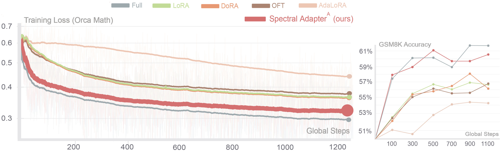

# Llama3 Experiments for Spectral Adapter


**Spectral Adapter: Fine-Tuning in Spectral Space** <br>
*Fangzhao Zhang, Mert Pilanci* <br>
Paper: [https://arxiv.org/abs/2405.13952](https://arxiv.org/abs/2405.13952) <br>

This repository is for reproducing Figure 1 result:
<p>

</p>

## Quickstart
Clone the repo and run the following command
 ```
 cd llama3_tune
 pip install -r requirements.txt
 cd lm-evaluation-harness
 pip install -e .
 cd ..
 ```

## Training 
Run the following command, can replace <code>spectral</code> with <code>full,lora,blocktt</code> for baselines.
```
CUDA_VISIBLE_DEVICES=7 python llama_tune.py --model=spectral >/dev/null 2>&1 &
```

Training is logged to Weights & Biases by default:
- project: <code>fura_sft_llama3_8B</code>
- run name: auto-generated as <code>{method}-{lr}-special-configs</code> (for example, LoRA includes rank; BlockTT includes rank/type/decomp/train-position)
- optionally append a suffix via <code>--suffix</code>

BlockTT example with explicit options:
```
CUDA_VISIBLE_DEVICES=7 python llama_tune.py --model=blocktt --lr=1e-5 --blocktt-type=all --decomp-mode=input_one_block --train-position=small --s-merged-to=frozen >/dev/null 2>&1 &
```

## Testing
Run the following command, can replace <code>spectral</code> with <code>full,lora,blocktt</code> for baselines. Defaultly, checkpoint is saved for <code>100,300,500,700,900,1100</code>.
```
python llama_test.py --model=spectral --checkpoint=100
```

For BlockTT evaluation, the script reads <code>blocktt_config.json</code> from the checkpoint directory to reconstruct the exact BlockTT structure before loading weights.

we report the 5-shot flexible-extract exact_match score. 
